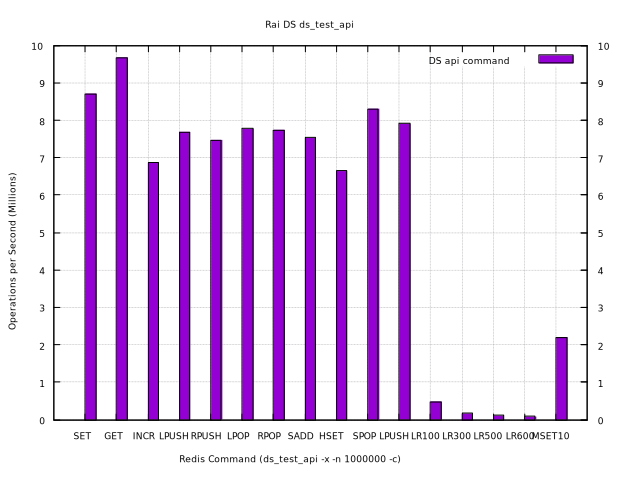
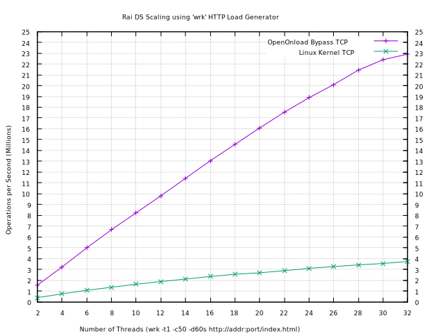
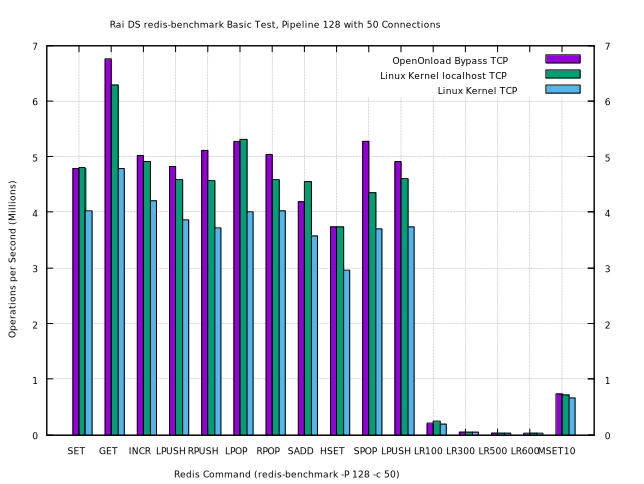
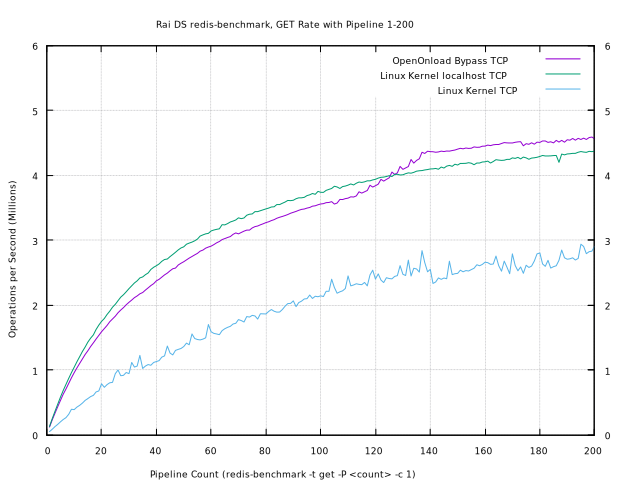
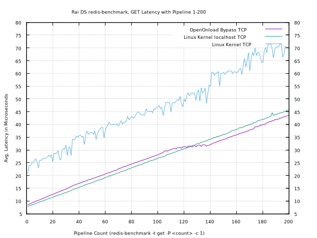
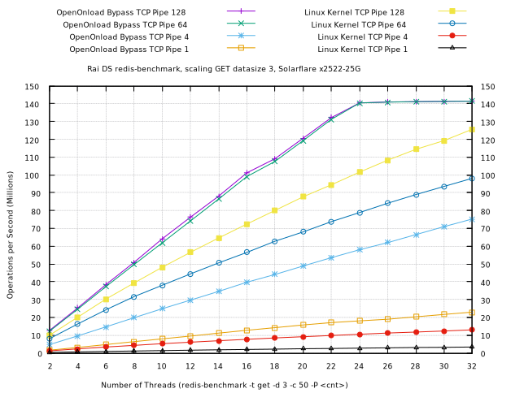
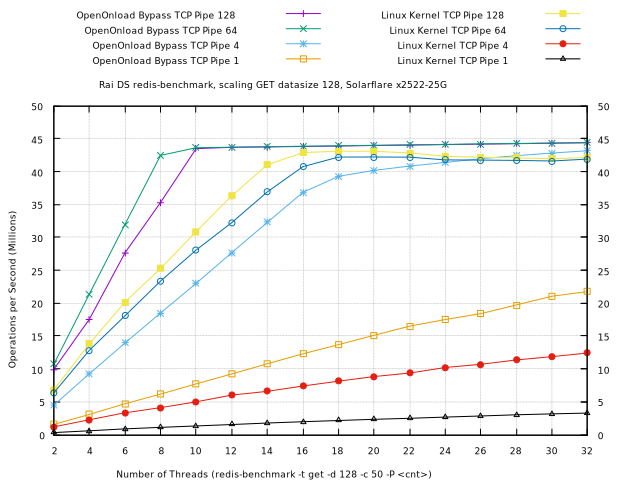
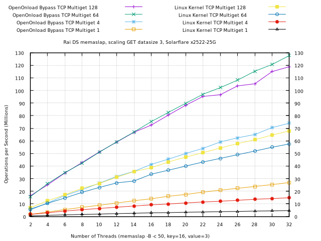
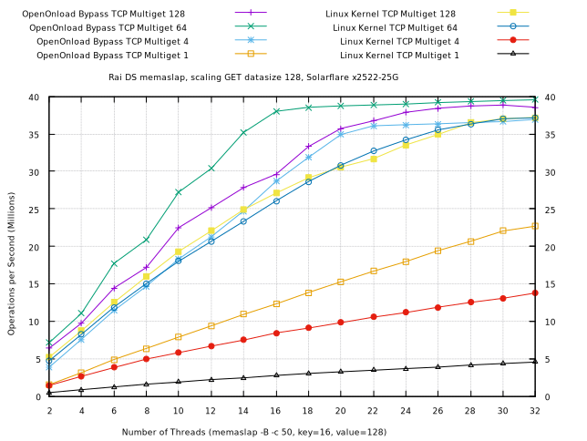

# Rai Distribution Services

[](https://copr.fedorainfracloud.org/coprs/injinj/gold/package/raids/)

1. [Description of Rai DS](#description-of-rai-ds)
2. [Current status of Rai DS](#current-status-of-rai-ds)
3. [Features of Rai DS](#features-of-rai-ds)
4. [How to Build Rai DS](#how-to-build-rai-ds)
5. [Installing Rai DS from COPR](#installing-rai-ds-from-copr)
6. [Testing Performance of Rai DS](#testing-performance-of-rai-ds)

## Description of Rai DS

Rai DS is a caching and distribution server and library built using [Rai
KV](https://github.com/raitechnology/raikv) shared memory and using [Rai
MD]((https://github.com/raitechnology/raimd) data structures.  It is intended
to provide protocol services to popular caching frameworks:  Redis and
Memcached, with additional services for bridging PubSub systems:  Http Websock,
[NATS](https://nats.io/about/), RV, CAPR.  These maintain compatiblity with the original systems, but the
idea here is not for complete compatibility, but to extend the tools and
infrastructure from these worlds into the more vertical domain that [Rai
Technologies](https://www.raitechnology.com/) has existed for long time:
caching market data.

Although Rai DS `ds_server` provides services compatible with
[Redis](https://github.com/redis/redis) and
[Memcached](https://github.com/memcached/memcached), this is not a drop in
replacement for them.  There are some things that both services do better
because they target different types applications.  Both systems have a long
history of service performed at high performance levels.  Rai has
traditionally focused on PubSub systems, and that is true of Rai DS as well.
The type of PubSub system Rai implements is a caching layer that bridges
publishers to subscribers while maintaining last value consistency between
publisher and subscriber.  This is different from a fire and forget system like
Redis and also different from a persistent queue system like Kafka.  Rai DS
aims to provide both fire and forget semantics or last value consistency,
depending the service type, but not persistent queues, except for the Redis
Stream data type.

### A Focus on Latency

The implementation of `ds_server` is an event driven single threaded, packing a
lot of protocol services that can be bound to a core(s) and accelerated with
[Solarflare OpenOnload](https://support.solarflare.com/wp/onload) or [Mellanox
VMA](https://www.mellanox.com/products/software/accelerator-software/vma).

One method of scaling up is to balance services bound to cores and utilizing
network hardware acceleration from the Solarflare and Mellanox, or native
Linux methods, such as the built-in load balancer that can forward TCP
connections to a cluster of processes all listening to the same port using
[SO_REUSEPORT](https://lwn.net/Articles/542629/).  There has also been a lot
of work accelerating containers, in order to isolate services from one another,
while using virtual hardware acceleration to direct traffic.

For these reasons, the design of Rai DS utilizes Rai KV shared memory that
can persist across multiple instances and/or local processing which can attach
and detach without disrupting each other.  This provides for vertical scaling
based on external considerations of hardware acceleration or software
clustering, more instances can be started or stopped at any time.  This is
scaling based on planning, resouces are used when allocated.

## Current status of Rai DS

The features that are missing but are planned are these:

1.  A backing store.  This is a persistent state saved on interval, but it
    should also be able to load on demand.  We plan on using
    [RocksDB](https://rocksdb.org/) for this.

2.  Secondary replication and high availability auto-failover.  In market data
    systems, this failover is traditionally a heart beat monitored in process
    and replay of the subscriptions that are open to try to acheive at least
    once behavior.

3.  Lua scripting using the Redis EVAL command set.

4.  Access control lists.  This would limit access to databases, keys, commands
    to groups of users.

## Features of Rai DS

1.  The current Redis command support is documented in the
    [Redis Command](doc/redis_cmd.adoc) asciidoc.  The document in
    this link is used to generate parser code used in `ds_server` and the 'C'
    DS API, because of it's structure and the way Redis defines the command
    arity and key positions.  The 'C' DS API does not communicate with
    `ds_server`, but interfaces directly with shared memory, providing
    nanosecond latency for Redis commands without pipelining them.  A call to 
    a function returns results immediately.  Since it is shared memory,
    all the operations are seen by Redis clients attached to the system over
    the network.  This also includes Redis PubSub commands (publish, subscribe)
    as well as the blocking commands (blpop), the stream commands (xread), and
    the monitor command.

    For example, reimplementing the `redis-benchmark` within the 'C' DS API:

      ```console
      $ RH8_x86_64/bin/ds_test_api -x -n 1000000 -c | tee test_api.csv
      "PING_BULK","34253518.75"
      "SET","8704074.99"
      ...
      $ sh graph/redis_histogram.sh test_api.csv > test_api
      $ gnuplot-qt -p graph/plot_test_api.gnuplot
      ```

      

      More redis-benchmark style graphs [below](#using-redis-benchmark).

2.  Multi-threading and/or multi-process support.  The [Rai KV](https://github.com/raitechnology/raikv)
    library fully supports locking shared memory by multiple processes or
    multiple threads.  It does this by having each thread assigned a context
    within the shared memory that allows for communicating the [MCS
    Locking](https://lwn.net/Articles/590243/) of hash entries and tracking
    statistics.  When a process attaches to the shared memory, it connect to
    all other processes/threads in the system which are also registered to
    create a shared memory ring buffer between each of them.  This results in a
    mesh of all to all IPC network nodes of heterogeneous event based
    processing cores, that tracks the subscriptions, the streams blocking, the
    lists blocking, the monitor command, and other features that are necessary
    for a multi-threaded Redis implementation.  These same mechanisms allow
    other PubSub systems to work as well, since the IPC network is general
    enough to adapt and bridge different subscription regimes.  This is
    possible since the subjects are just KV keys and different subscription
    wildcards can all be translated to
    [PCRE2](https://pcre.org/current/doc/html/) expressions.

3.  Aggressive use of memory prefetching in `ds_server`.  A network that has
    even a couple of microseconds latency may have 1000s of requests in flight
    with a hundred or more clients, all independent.  This provides an
    opportunity to both order the requests by hash position and prefetch the
    memory locations to increase throughput.  The effect of prefetching can be
    dramatic, see the [Rai KV prefetching
    test](https://github.com/raitechnology/raikv#prefetching-hashtable-lookups).

4.  Support IEEE 754-2008 decimal arithmatic.  The 128 bit decimals are used
    when operating on real numbers within the Redis INCRBYFLOAT commands.  The
    64 bit decimals are used when operating on scores within the Redis sorted
    set commands.  This fixes the loss of precision when converting between
    binary floating point and string decimal representations of real numbers.
    It also remembers the precision of the inputs, for example:  1.10 + 2.2 is
    3.30, not 3.30000019.

4.  Memcached TCP and UDP support.  All memcached operations can operate on
    the same String data type that Redis commands do.  The UDP path is
    optimized better than memcached, utilizing {recv,send}mmsg calls.  This
    helps especially when lots of small items are requested from the cache.

5.  Http supports Redis commands using URIs.  The first command below returns a
    Redis RESP format response, the second command returns a Redis JSON
    response, and the third returns a String item as it is cached.  The latter
    is useful for caching Http objects, the mime type is determined by the key
    extension.  The last uses POST to set a key value.

      ```console
      # example of Redis RESP response, executing "get index.html", "lrange list 0 -1"
      $ curl 'http://127.0.0.1:48080/?get+index.html'
      $47
      <html>
      <body>
      hello world
      </body>
      </html>
      $ curl 'http://127.0.0.1:48080/?lrange+list+0+-1'
      *3
      $3
      one
      $3
      two
      $5
      three

      # example of JSONify response, executing "get index.html", "lrange list 0 -1"
      $ curl 'http://127.0.0.1:48080/js?get+index.html'
      "<html>\r\n<body>\r\nhello world\r\n</body>\r\n</html>\r\n"
      $ curl 'http://127.0.0.1:48080/js?lrange+list+0+-1'
      ["one","two","three"]

      # example of text/html result, executing "get index.html", get is implied
      $ curl http://127.0.0.1:48080/index.html                                 
      <html>
      <body>
      hello world
      </body>
      </html>

      # example of POST, "set README.md file:README.md" (the content-type is ignored)
      $ curl -X POST -H 'Content-Type: text/markdown' --data-binary '@README.md' http://127.0.0.1:48080/README.md
      <html><body>  Created   </body></html>
      ```

    The speed of processing small object requests very likely exceeds most
    general purpose web servers, while having the ability to update the data
    using Redis commands or PubSub feeds.

6.  Websocket Http upgrade supports Redis commands optionally returning
    JSONified results, like the Http support above.  A Websocket initializes
    with a request for a protocol.  This protocol can be "resp", "json", or
    "term".  If the "term" protocol is used, then the server "cooks" the input
    as if it were a terminal by echoing and processing control characters like
    arrow keys for editing a command.  This works with a client using
    [xterm.js](https://xtermjs.org) with the
    [attach](https://xtermjs.org/docs/api/addons/attach/) addon in the browser.

## How to Build Rai DS

The current implementation uses x86_64 hardware based AES hashing and can use
Posix, SysV, or mmap() based shared memory.  These Linuxes are known to work:
CentOS 7, 8 or Fedora >=27, or Ubuntu 16, 18, 20, or Debian 9, 10.  It will
also run under Windows Subsystem for Linux with Ubuntu 18.  Minimum x64 CPU is
a Intel Sandy Bridge or an AMD Ryzen (with AVX/SSE4 extentions).

Clone this and then update the submodules.

```console
$ git clone https://github.com/raitechnology/raids
$ cd raids
$ git submodule update --init --recursive
```

### Software dependencies

The dependencies for CentOS/Fedora are a make dependency called `dnf_depend` or
`yum_depend`.  There is a `deb_depend` target for Ubuntu/Debian systems.

```console
$ make dnf_depend
sudo dnf -y install make gcc-c++ git redhat-lsb openssl-devel pcre2-devel chrpath liblzf-devel zlib-devel libbsd-devel c-ares-devel
Package make-1:4.3-11.fc37.x86_64 is already installed.
Package gcc-c++-12.2.1-2.fc37.x86_64 is already installed.
Package git-2.38.1-1.fc37.x86_64 is already installed.
Package redhat-lsb-4.1-59.fc37.x86_64 is already installed.
Package openssl-devel-1:3.0.5-2.fc37.x86_64 is already installed.
Package pcre2-devel-10.40-1.fc37.1.x86_64 is already installed.
Package chrpath-0.16-18.fc37.x86_64 is already installed.
Package liblzf-devel-3.6-24.fc37.x86_64 is already installed.
Package zlib-devel-1.2.12-5.fc37.x86_64 is already installed.
Package libbsd-devel-0.10.0-10.fc37.x86_64 is already installed.
Package c-ares-devel-1.17.2-3.fc37.x86_64 is already installed.
Dependencies resolved.
Nothing to do.
Complete!
```

If building an rpm or a dpkg is desired, then also install these:

CentOS/Fedora

```console
$ sudo dnf install chrpath rpm-build
```

Ubuntu/Debian

```console
$ sudo apt-get install chrpath devscripts
```

### Building

And finally, make.

```console
$ make
```

The binaries will work from the working directory, there are no config files.

Installing requires installing all of the submodules first by running `make
dist_rpm` or `make dist_dpkg` in each of the submodule directories then
installing via rpm or dpkg.

## Installing Rai DS from COPR

Current development RPM builds are installable from
[copr](https://copr.fedorainfracloud.org/coprs/injinj/gold).  These builds are
clonable, so it is easy to get a recent build by cloning the packages and
rebuilding.

Installing from copr automaticlly resolves all of the dependencies using the
system package manager `dnf` or `yum`, simplifying installing to a single
install command.

```console
$ sudo dnf copr enable injinj/gold
$ sudo dnf install raids
```

This has a systemd raids.service configuration which will start a service on
the network for Redis, Memcached, Http.  After starting this, there should be a
2GB shared memory segment.  This segment is created by `kv_server`, which is
also started by systemd.  Any values store in the shared memory will be available
until `kv_server` is restarted.  Restarting `ds_server` does not affect the
contents of the shared memory segment.

```console
# start ds_server and kv_server if it is not already running
$ sudo systemctl start raids
$ ipcs -m

------ Shared Memory Segments --------
key        shmid      owner      perms      bytes      nattch     status
0x9a6d37aa 98305      raikv      660        2147483648 0

$ ds_client
connected: 6379 (redis)
ds@robotron[0]> set hello world
'OK'
ds@robotron[1]> get hello
"world"
ds@robotron[2]> q
bye

# stop ds_server
$ sudo systemctl stop raids

# attach directly to shared memory, must be in group raikv
$ groups
users raikv

$ ds_client -m sysv:raikv.shm
opened: sysv:raikv.shm
ds@robotron[3]> get hello
"world"
ds@robotron[4]> q
bye
```

## Testing Performance of Rai DS

There are 3 performance metrics below.  The first is a http test, the second is
a `redis-benchmark` test, and the thired is a `memaslap` test.  The tests are
run with the Linux Kernel TCP and with the Solarflare OpenOnload TCP Kernel
Bypass running with a dual port [Solarflare X2522-25G](https://www.xilinx.com/publications/product-briefs/xtremescale-x2522-product-brief.pdf).

There are three systems involved running CentOS 8, a
[Ryzen 3970x](https://www.amd.com/en/products/cpu/amd-ryzen-threadripper-3970x#product-specs)
32 core cpu running the `ds_server` and 2 client systems, both using an
[Intel i9-10980xe](https://ark.intel.com/content/www/us/en/ark/products/198017/intel-core-i9-10980xe-extreme-edition-processor-24-75m-cache-3-00-ghz.html)
18 core cpu, all with the Solarflare X2522-25G adapter.  They are connected
with both clients using a port on the AMD Ryzen system.

The shared memory segment is created with default parameters, using the System
V shm mapping using the 1GB page size.  These benchmarks stress the networking
event processing and the protocol components, not the KV store.

These benchmarks are meant to be repeatable on different hardware and highlight
the variety of `ds_server` protocols.  The systems used in the benchmarks are
workstations and not servers, the instructions to replicate them for different
environments are in this [README](graph/README.md).  Kernel bypass technologies
will perform better in most situations where a network is involved.  The Linux
Kernel network stack is important as well, since a lot of infrastructure is
built around it that bypassing it may not be ideal.

Scaling is important to provide multiple paths to access the KV data at
predictable latency, for example, partitioning simple reads from complex Redis
transactions, pubsub distribution, and updates.  The aggregate numbers are not
as important as the linear scaling even though they are closely related, since
many architectures do benefit from several networks statically split and
assigned to different CPUs.

### Using wrk HTTPD loading

The first test is a well known web benchmark using the
[wrk](https://github.com/wg/wrk) load generator.  It fetches a small 42 byte
index.html web page over and over again using `GET /index.html HTTP/1.1`, so it
does not stress the caching system, since there is only one key retrieved,
rather it tests the HTTP protocol processing and Redis get value processing.
The network bandwidth limit of a 109 byte request and 209 byte result (which
includes TCP framing) is

    2 ports * 25 Gigabits / 209 bytes result = 30 million/sec



See [this](graph/README.md#using-wrk-httpd-loading) for the steps to reproduce
the above.

### Using redis-benchmark

This is the classic histogram of `redis-benchmark` with the default tests at 50
connections with a pipeline of 128 operations on each connection.  It shows the
best throughput of a single threaded instance without testing the KV or the
Redis data structures.  It does test the network and the Redis
[RESP](https://redis.io/topics/protocol) TCP command processing.  There is only
one key per data structure and the hash and set commands are only operating
with a single member.  The pipeline combines operations in batches of 128,
which has the effect of negating the network latency since transmitting batches
of 128 cost about the same as a transmitting single operation.  The LIST
operations do have an effect on the data cached, but the HASH and the SET are
repeatedly adding the same element to the same key.  The results for these are
not very useful, but they are often included anyway.



Latency is an important aspect, so this shows the effect of different pipelines
on processing speeds.  The latency of an individual request in a pipeline can
roughly be calculated by the rate / pipeline size, if there is one connection.
The following are the message rates of scaling the pipeline counts over a
single connection.



This is the same data inverting the rate by the pipeline size to estimate the
latency of each message in the batch to arrive at the mean latency.  The Linux
Kernel latency could benefit from fixing the network interrupts to a core close
to the processing thread, since the Ryzen 3970x cores are not symmetrical, it
should be smoother than it is.



This next test is scaling the Redis GET command, basically following the
[Cloud Onload Redis Cookbook](https://www.xilinx.com/publications/onload/sf-onload-redis-cookbook.pdf).
The cookbook uses the 128 command pipeline across many cores with a Redis
instance on each core, using a single key.  This scales the pipeline and
uses multiple Rai DS instances which share the same data.  The first uses the
default data size of 3 bytes.  The network bandwidth limit is 

    2 ports * 25 Gigabits / ( 42 bytes GET request + 1.25 TCP overhead ) = 144 million/sec

The TCP overhead is averaged over the pipeline of 128 requests fitting in a
1500 byte frame size, which is 1.25 bytes per request.



This second uses the 128 byte size as the cookbook uses.  The cookbook only
uses one port and underestimates the Kernel TCP stack compared to these
results.  The network bandwidth limit is

    2 ports * 25 Gigabits / ( 136 bytes GET result + 3.75 TCP overhead ) = 44 million/sec

The TCP overhead is averaged over the pipeline of 128 results fitting in a
1500 byte frame size, which is 3.75 bytes per result.



See [this](graph/README.md#using-redis-benchmark) for the steps to reproduce
the above.

### Using libmemcached memaslap

The memaslap load generator doesn't allow for selecting the range of keys to
get, instead it randomly generates them and preloads the cache before starting
the get benchmark.  Since there are several memaslap processes running and each
loads keys, the number of keys increases as more are processes are added.
Memaslap doesn't pipeline commands like redis-benchmark does, but it does have
a multiget capability, so that was used instead of pipelining.

The first test uses a datasize is 3 bytes, the network bandwidth limit is

    2 ports * 25 Gigabits / ( 40 bytes GET request + 1.25 TCP overhead ) = 151 million/sec

The TCP overhead is averaged over the multiget of 128 requests fitting in a 
1500 byte frame size, which is 1.25 bytes per request.



The second test uses a datasize is 128 bytes, the network bandwidth limit is

    2 ports * 25 Gigabits / ( 156 bytes GET result + 4.375 TCP overhead ) = 39 million/sec

The TCP overhead is averaged over the multiget of 128 results fitting in a 
1500 byte frame size, which is 4.375 bytes per request.


